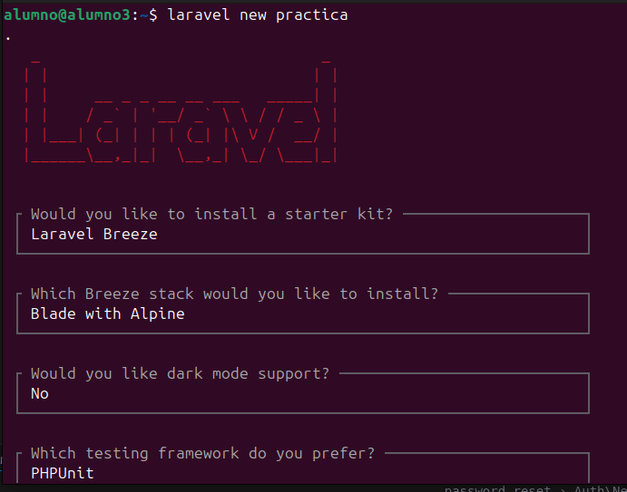
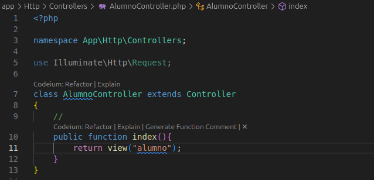

## Creo el proyecto

```bash
laravel new practica, e instalamos Breeze


creo las dependencias


levanto el programa


creo un layout con las carpetas header, nav, footer,y layout


voy a routes y modifico, añado las rutas del resto de paginas


creo la carpeta main.blade.php en la carpeta resources view .Que es como la plantilla base de mi proyecto. cambio lo que había por <x-layout.layout> que indica que se esta utilizando un componente dentro del directorio layout.blade.php.


modificada ruta de logeo, 


en controladores modificado el registered y el authenticated por main


una vez logeado para que me acceda a una de las páginas por ejemplo alumno voy a Controllers - Auth y creo AlumnoController.php


y creo donde va a ir el contenido de la pagina en Components y creo alumno.blade.php


para cambiar que en la pestaña salga donde estamos vamos a Components Layout y poner una variable para indicar donde tiene que apuntar


despues en cada layout de cada pagina añadimos title=... la pagina en la que estemos


En header.blade.php hacemos otro nuevo header para poder acomplar nuestra pagina en modo responsive y ahí colocamos un input establezco un checked que lo asocio a la clase peer y un div, para poder conseguir el menu hamburguesa


Creo un documento llamado docker-compose.yaml. y ahí pondre los servicios que quiero